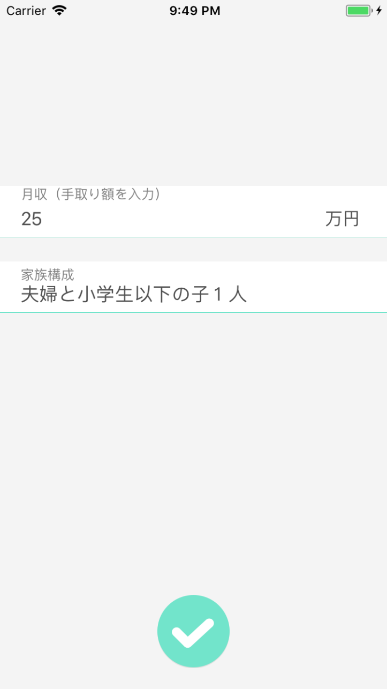

# HouseBalance for iOS

The app in this project is a simple household expenditure calculator. Also, [released in the App Store](http://goo.gl/G2EVwQ).  
This project structure adopts RxSwift on MVVM architecture.

| View1 | View2 | Popup Dialog |
|-|-|-|
|  |  |  |

## Getting Started

1. Clone this repository.
1. `cd housebalance-ios`
1. `carthage update --platform iOS --no-use-binaries`
